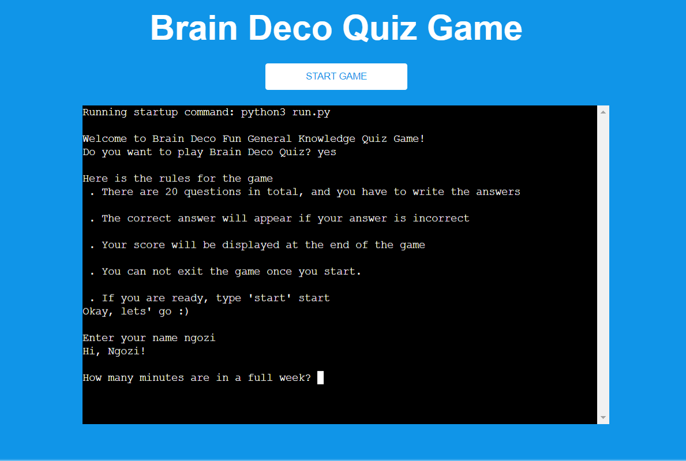
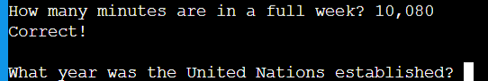
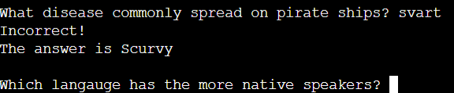
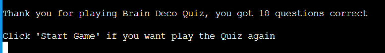
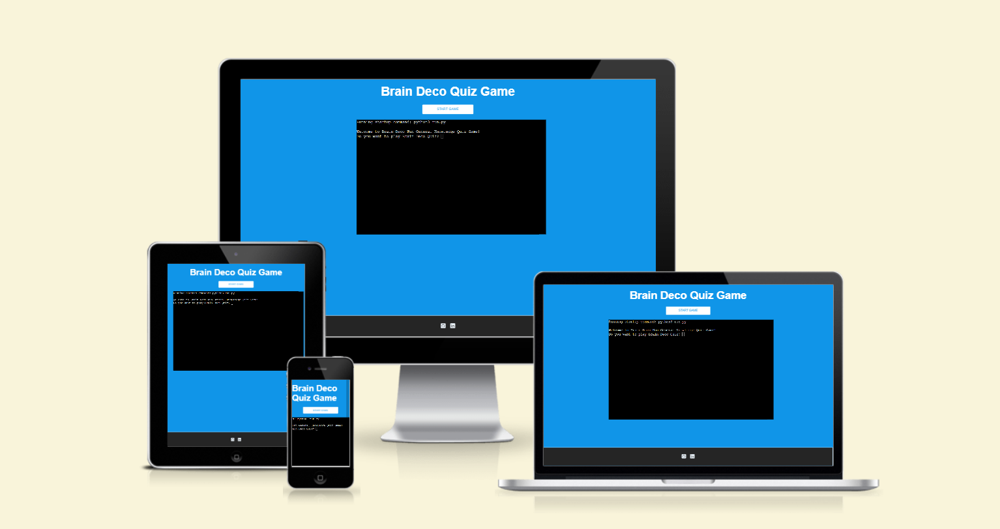
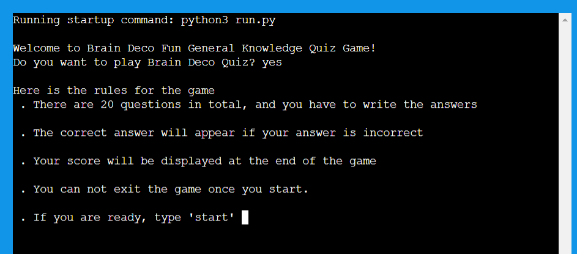
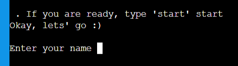
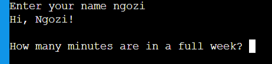
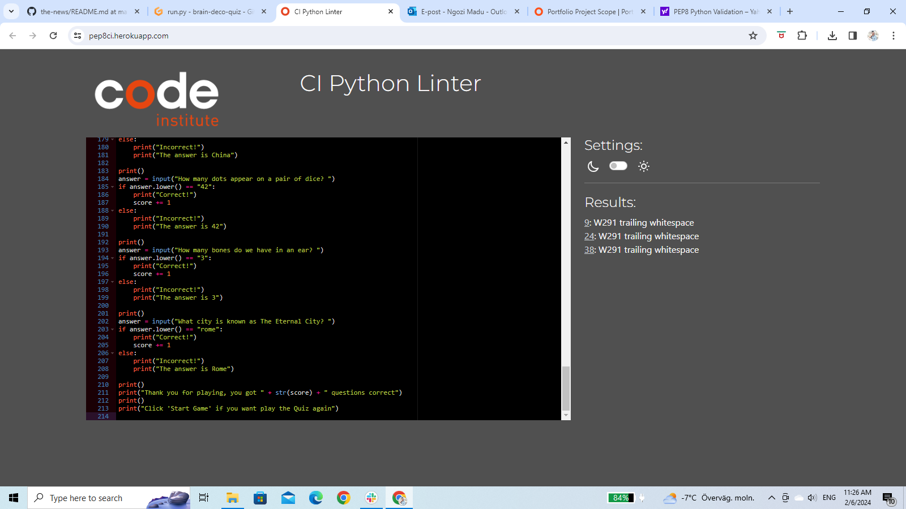

# Brain Deco Quiz (Milestone Project 3)

Brain deco live link can be found here - <https://brain-deco-quiz-98056f8f6144.herokuapp.com/>

## Purpose
Brain Deco quiz app is a fun general quiz game design to test ones knowledge. The live link can be found here - <https://brain-deco-quiz-98056f8f6144.herokuapp.com/>

Brain Deco quiz is a fun to play quiz, it engage and energize the audience by asking general questions while the auidence types the answer. 

Th quiz has 20 questions in total and the player gets one point when he or she answered correctly.

When player answer is correct the next question displays but when the play answer is incorrect, the correct answer will display before the next question.

At the end of the quiz the player will see his or her score and know how many he or she got right.

This quiz game app demonstrate how pure python works in a real-world context, and can be played by anyone from age 16  who  love quiz. The questions are carefully sellected to make user to keep playing.

The site is a fully responsive python game that will allow users to read a question regardless of the screen size.

## Features

### Existing Features

### Brain Deco app Heading

- Featured at the top of the page is the Brain Deco quiz app heading and is easy to see for the users.
Upon viewing the page, the user will be able to see the name of the game and a start game button!

### The Game Area

- The quiz game site have a welcome message for user followed by a question if user wants to play Brain Deco Quiz.

- If user types yes then the quiz rules will be displayed but if user types no then the game ends.

- After the game rules, the play has option to quit or start the game. If user choose to start the game, the the user will enter his or her name then the questions starts dropping.

- The are 20 questions that display one after the other when user types answer.
- Once the user types an answer, its irreversible. If player is correct it will display "Correct" and if the answer is incorrect, it will display "Incorrect" and print the correct answer and this contines till the last question is answered.

- At the end the user will get a thank you message followed by their score and as well a message to direct the user where to click if user wants to try again.

### The Score Area

- The uses will only see result at the end of the game.

## First Time Visitor Goal

- As a first-time user I want to easily understand what the site main purpose is all about.

- As first-time user I use my phone often, so I want to view the website content clearly on my mobile.

- As a first-time user I want to found the site interesting.

## Returning Visitors Goals

- As a returning use I want to play the game again

### Features Left to Implement
- Timer

## Testing

### Validator Testing
- I have tested this project code by:
- Pasting the code on PEP8 linter and there were no error found. 
- Tested after deployment on Code Institute Heroku terminal and it run successfully

## Deployment

This project was deployed using Code Institute's mock terminal for Heroku and the steps for deployment are as followed:
### First step
- Sign in to Heroku app
- Create a new app with a unique name
- Go to setting and create a _Config Var_ called `PORT`. Set the value to `8000`
- Then click on  buildpacks and add the following:
1. `heroku/python`
2. `heroku/nodejs`

### Second step
- Click on deploy at the top left side and select github to connect to github. Confirm your connection to github and search for the github repository name, click connect to link up the Heroku app creacted ealier with the repository.
- Choose either automatic deploy or manual. I used manual which is deploy branch.
- Allow the app to build until it shows successfully then click view and it takes me to my live deployed link.